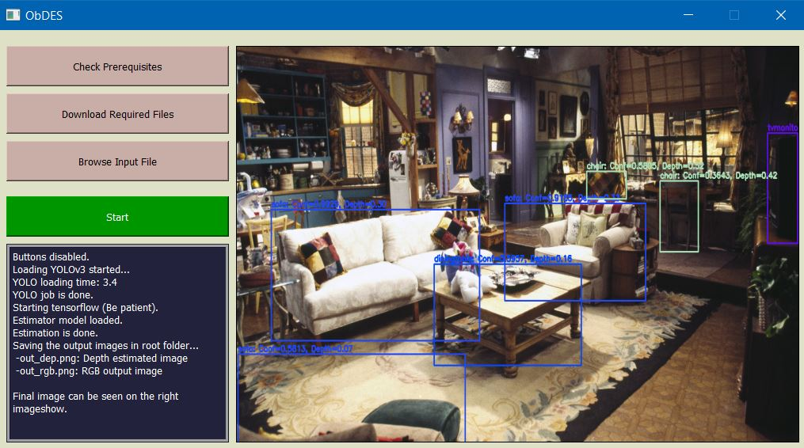

<p align="center">
  <a href="" rel="noopener">
 </a>
</p>

<h3 align="center">ObDES: Object Detection and depth EStimation</h3>

---

<p align="center">
Sharif University of Technology<br/>
Deep Learning course project - Fall 1400<br/>
Supervisors: <a target="_blank" href="http://ee.sharif.edu/~fatemizadeh/">Prof. Emad Fatemizadeh</a> - <a target="_blank" href="http://ee.sharif.edu/~behrad.ahmadpour/">Behrad Ahmadpour</a><br/>
</p>

## 📝 Table of Contents

- [About](#about)
- [Getting Started](#getting_started)
- [Some results](#results)
- [Authors](#authors)

## About project:<a id = "about"></a>

In this project we created a PyQt5 base application which will take a photo as input and will produce the result which is the same photo with bounding boxes around the objects. For each of those bounding boxes, there will be a lable of what category that object belongs to? with what confidency? and how far that object is from the camera?<br/> (In scale of 0 to 1 [ 0: so close, 1: far far away])

## Getting Started: <a id = "getting_started"></a>

On this project we have 3 main files:
* ObDES_colab_notebook.ipynb : This is the first and the most complete file of the project. It runs on the Google colab and it's not related to the GUI section of project. But it will create one of the most important files which is necessary to make GUI section able to work: Estimation model w8s (weights).<br/> This notebook file consists of 3 main part. In the first part we use NYUv2 dataset to produce enough pictures to learn the estimation model which is an autoencoder network.<br/>In second part of the file, we will train the estimation model by using the created pictures in the previous part. Then we save the created model as estiamtion_model.h5 in the resources directory.<br/>
In the third part of the project we will use the produced pictures and the learned model in collaboration with YOLOv3 pre-trained model to finalize our project. first of all we will download and save the YOLOv3 necessary files (coco.names, yolov3.cfg and yolov3weights) in the resources directory as well. And we direcly create the joint output of the whole network. We will use the bounding boxed to identify which pixels should be considered as the object pixels and then we will take an average on those pixels and the final result will be considered as object distance from camera.
* ObDES.py : This is the one run file of the almost whole project but without the GUI features. In this file we will use the results of first 2 parts of the Google colab notebook to run the YOLO model and take the results directly. For this purpose all of the 4 files of resources directory should be downloaded before the main processes. This downloading processes will be done automatically. Just give this file a good internet connection and wait for about 640 MB of files to be downloaded (240 MB is for the YOLOv3 weights and almost the rest of it is for the estimation_model.zip file).
* ObDES_GUI.py : The automatic downloading procedure is like the previous part. But first you can check what files are missing. This file is nothing but a PyQt based GUI of the ObDES.py file.
<br/>These instructions will get you a copy of the project up and running on your local machine for development and testing purposes. See [deployment](#deployment) for notes on how to deploy the project on a live system.

### Prerequisites

We need some libraries to be installed on the environment first. We used a python 3.8 library for the project.
```
General libs:
  os,
  sys,
  time,
  numpy,
  shutil,
  zipfile,
  traceback,
  progressbar,
  urllib.request,
  matplotlib.pyplot,

To be installed:
  cv2,
  pillow,
  tensorflow + keras,
  PyQt5 (QtCore, QtGui, QtWidgets),
...
```
Some packages version:
```
Versions:
OpenCV      => 4.5.5
PyQt        => 5.9.7
Tensorflow  => 2.7.0
```

## Some results: <a id = "results"></a>

Out model works fine with almost every picture. But it will be so much better if we train it with more pictures. We train estimator model only with 1449 pictures of NYUv2 dataset and under 60 epochs. This is absolutely nothing against the coco dataset which has about 338 k pictures. By the way, our current model has great capabilities. We bring some results here as examples:
<table style="text-align:center;">
<tr><td>Input image</td><td>Depth image</td><td>Final image</td></tr>
<tr>
<td></td>
<td></td></td>
<td></td></td>
</tr>
<tr>
<td></td>
<td></td></td>
<td></td></td>
</tr>
<tr>
<td></td>
<td></td></td>
<td></td></td>
</tr>
</table>
Let's bring one of these examples in big size:
<p align="center"></p>
<p align="center"></p>
<p align="center"></p>

## Contributors: <a id = "authors"></a>
- <a href="https://github.com/Soroosh-N">Soroosh Noorzad</a> [99205372][M.Sc.][Digital Electronics]
- <a href="https://github.com/AFP1333">Abolfazl Fallah Pakdaman</a> [99205326][M.Sc.][Digital Electronics]
